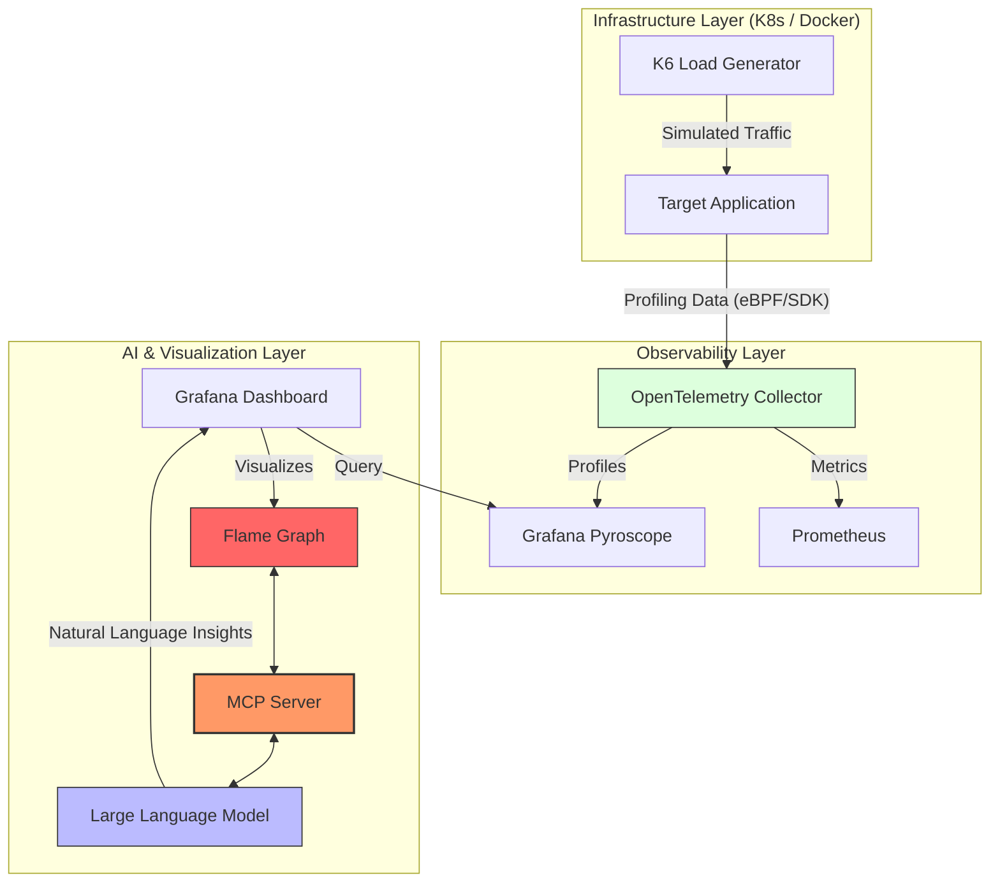

# Flame Graph with AI Interpretation (Project Type 3)

## 📝 Project Description
The primary goal of project is to build an advanced Observability ecosystem that leverages real-time application profiling and Large Language Models (LLM) to automatically interpret performance bottlenecks.

The core of the solution is the **Flame Graph** visualization. By integrating the **Model Context Protocol (MCP)**, the system allows an AI model to perform deep analysis of the call stack and suggest specific code optimizations directly within the Grafana interface.

## 🎯 Project Goals
* **Automated Diagnostics:** Reducing the Mean Time To Repair (MTTR) by using AI-powered insights.
* **Continuous Profiling:** Implementing a mechanism for continuous profile collection from applications running in a containerized environment (Kubernetes).
* **MCP Integration:** Practical application of the Model Context Protocol as a secure data bridge between local infrastructure and LLM providers.
* **Load Simulation:** Using K6 to generate realistic service degradation scenarios (e.g., memory leaks, high CPU spikes).

---

## 🏗 High-Level Architecture (Flow)

The system architecture is based on three main data flow layers:

1. **Infrastructure Layer:**
   * **K6** generates traffic that stresses the **Application** running on **Kubernetes**.
   * An **OpenTelemetry** agent captures profiling data (CPU/RAM usage per function).

2. **Data & Observability Layer:**
   * Metrics are sent to **Prometheus**, while performance profiles are sent to **Grafana Pyroscope**.
   * Data is aggregated and prepared for visualization.

3. **Intelligence & Visualization Layer:**
   * **Grafana** displays an interactive **Flame Graph**.
   * The **MCP Server** acts as a bridge, sending the graph context to the **LLM**.
   * The AI model analyzes the code stack and returns a human-readable diagnosis to the user within the Grafana panel.

---

## 🔍 Case Study: The 'Inefficient Sorter' Service

To demonstrate the power of AI interpretation, we developed a dedicated microservice with a deliberate performance flaw:

### 1. The Application Logic
The service provides two main endpoints:
* **`/fast`**: Performs an optimized sorting operation using a built-in library (O(n log n)).
* **`/slow`**: Intentionally uses a **Bubble Sort** algorithm (O(n²)) on a large dataset. This creates a massive "plateau" on the Flame Graph, consuming 90% of the CPU time.

### 2. The Observability Flow
1.  **K6** sends a flood of requests to the `/slow` endpoint.
2.  **OpenTelemetry** records that the CPU is spent almost entirely within a function named `bubbleSort()`.
3.  **Grafana Pyroscope** generates a Flame Graph where the `bubbleSort` stack is extremely wide, signaling a bottleneck.

### 3. AI Interpretation
When a developer clicks on the Flame Graph, the **MCP Server** sends the function names and execution times to the **LLM**. 
* **The AI prompt:** "Analyze this profiling data. Why is the application slow?"
* **The AI response:** "The application is spending 92% of its time in `bubbleSort`. This is an inefficient algorithm for large datasets. I recommend replacing it with `QuickSort` or `MergeSort` to reduce complexity from O(n²) to O(n log n)."

---

## 🛠 Technology Stack

| Component | Technology | Role |
| :--- | :--- | :--- |
| **Orchestration** | Kubernetes (k3d/minikube) | Container and infrastructure management. |
| **Profiling** | OpenTelemetry / Pyroscope | Collecting resource usage data per code function. |
| **Load Testing** | K6 (Grafana) | Generating traffic and CPU/Memory load. |
| **Visualization** | Grafana | Central monitoring dashboard and Flame Graph interface. |
| **AI Bridge** | MCP Server | Protocol providing data context for the LLM. |
| **Brain** | LLM (e.g., Claude / GPT) | Bottleneck analysis and optimization recommendations. |

---
